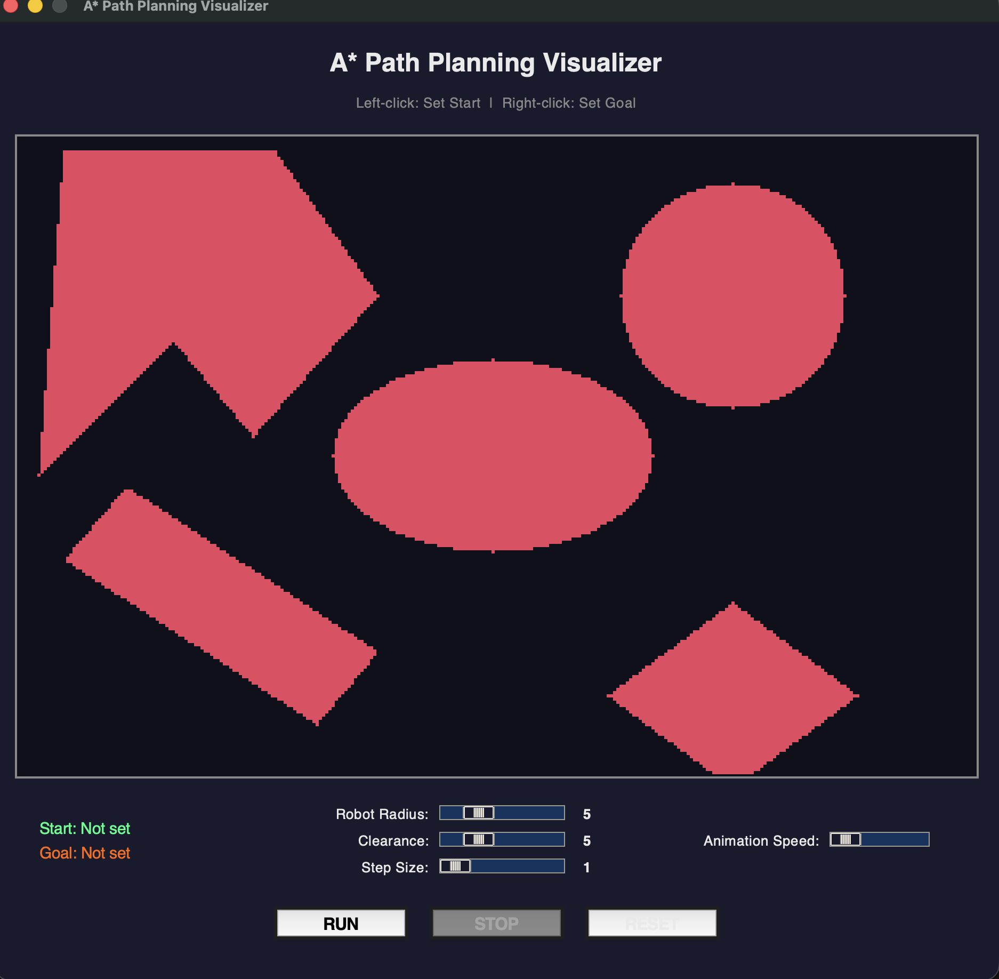
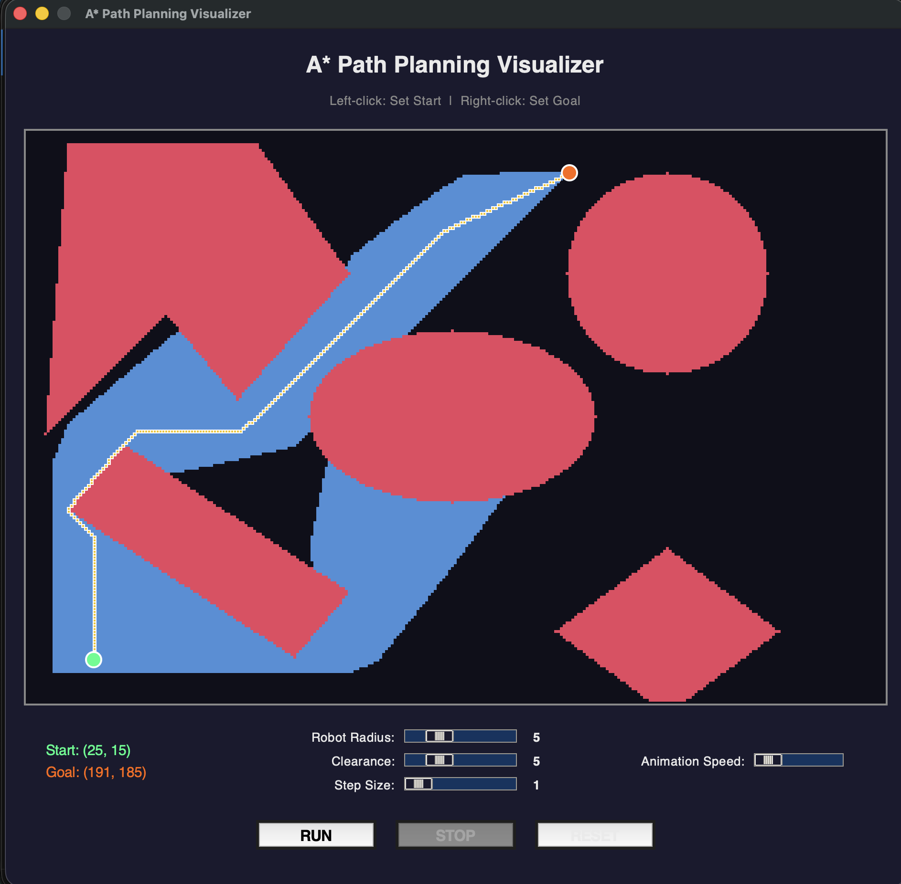

# Path Planning for Autonomous Vehicles — Dijkstra's Algorithm

**GitHub:** https://github.com/OfirHaf/Autonomic-Vehicle

---

## Introduction

This project implements **Dijkstra's shortest-path algorithm** for an Autonomous Vehicle (AV) navigating a 2-D environment with static obstacles and **terrain cost zones**.

Unlike A*, Dijkstra uses **no heuristic** — it expands nodes strictly by cumulative cost from the start. This guarantees finding the globally optimal path in any weighted graph, at the cost of exploring more of the map.

### AV-Specific Feature — Weighted Terrain

A real autonomous vehicle does not treat all drivable space equally. Roads are cheap to traverse; sidewalks and rough terrain are expensive. Three terrain cost zones are modelled:

| Zone | Cost Multiplier | Represents |
|------|-----------------|-----------|
| Road (dark green bands) | ×1.0 | Paved lanes |
| Open space (default) | ×2.5 | Parking lots, plazas |
| Off-road (dark blue bands) | ×6.0 | Sidewalks, rough terrain |

Dijkstra naturally routes the vehicle through the cheapest path — preferring roads even if they are not the geometrically shortest route.

---

## Algorithm — How Dijkstra Works

1. Assign cost ∞ to every node; set start cost to 0.
2. Push start into a **min-heap** (priority queue).
3. Pop the node with the **lowest cumulative cost**.
4. For each unvisited neighbour, compute `new_cost = current_cost + edge_weight`.
5. If `new_cost < neighbour's current cost`, update it and push to the heap.
6. Repeat until the goal is popped (optimal path guaranteed) or the heap is empty (no path).

**Edge weight formula:**
```
weight = base_move_cost × average_terrain_cost(from, to)
```
- Straight move: `base = 1.0 × step_size`
- Diagonal move: `base = √2 × step_size`

---

## Screenshots

Interactive GUI showing the obstacle map and terrain cost zones:


Dijkstra exploration (blue cells) and the final optimal path (teal):


---

## Project Structure

```
Autonomic-Vehicle/
├── Code/
│   ├── utils.py        # Dijkstra class — algorithm, terrain zones, CLI animation
│   ├── gui.py          # Main GUI application (DijkstraGUI)
│   ├── gui_canvas.py   # Canvas rendering — terrain, obstacles, path cells, markers
│   ├── gui_config.py   # Colors, grid settings, terrain zones (derived from utils.py)
│   └── dijkstra.py     # Command-line entry point
├── Screenshot1.png     # GUI — obstacle map view
├── Screenshot2.png     # GUI — exploration + optimal path view
└── README.md
```

### Module Responsibilities

| File | Responsibility |
|------|---------------|
| `utils.py` | `Dijkstra` class: boundary checks, obstacle map, 8-directional search, terrain costs, CLI video export. Also owns `ROAD_ROWS` / `OFFROAD_ROWS` — the single source of truth for zone boundaries. |
| `gui_config.py` | All visual constants: colors, grid size, slider ranges, defaults. Imports zone boundaries from `utils.py` and derives `TERRAIN_ZONES` automatically — no duplication. |
| `gui_canvas.py` | `PathCanvas` (subclass of `tk.Canvas`): draws terrain shading, inflated obstacles, explored cells, final path, and start/goal markers. |
| `gui.py` | `DijkstraGUI`: wires sliders, buttons, canvas, and animation loop. Entry point via `main()`. |
| `dijkstra.py` | CLI wrapper: prompts for inputs, runs search, exports `dijkstra_path.avi`. Safe to import — all logic is under `if __name__ == "__main__":`. |

---

## Requirements

- Python 3.8+
- numpy
- OpenCV (`cv2`) — CLI video export only
- tkinter — included with Python on Windows/macOS

```bash
pip install numpy opencv-python
```

---

## How to Run

### 1 — Clone the repository

```bash
git clone https://github.com/OfirHaf/Autonomic-Vehicle.git
cd Autonomic-Vehicle
```

### 2 — Install dependencies

```bash
pip install numpy opencv-python
```

> `tkinter` is included with Python on Windows and macOS. On Ubuntu/Debian run `sudo apt install python3-tk`.

### 3 — Launch the GUI (Recommended)

```bash
cd Code
python gui.py
```

The window opens with the obstacle map and terrain zones pre-rendered. No further setup required.

#### Controls

| Action | Input |
|--------|-------|
| Set **start** point | Left-click on the canvas |
| Set **goal** point | Right-click on the canvas |
| Run Dijkstra | Click **RUN** or press `Enter` |
| Stop animation | Click **STOP** or press `Escape` |
| Reset everything | Click **RESET** or press `R` |

#### Parameter Sliders

| Slider | Effect |
|--------|--------|
| Robot Radius | Inflates all obstacle boundaries to fit the robot body |
| Clearance | Extra safety margin on top of the robot radius |
| Step Size | Grid movement granularity (1 = finest path, 10 = coarser but faster) |
| Anim Speed | Controls animation frame rate — higher = faster playback |

**Tip:** Place start and goal in different terrain zones and watch how the path bends toward the green road bands to minimise weighted cost.

### 4 — Command-Line Mode (exports AVI video)

```bash
cd Code
python dijkstra.py
```

Prompts for start/goal coordinates, robot radius, clearance, and step size.  
Outputs: optimal weighted distance, nodes explored, path length, and `dijkstra_path.avi`.

---

## Obstacle Map

The map is a 300 × 200 grid containing:

| Obstacle | Shape |
|----------|-------|
| Circle | Centre (150, 225), radius 25 |
| Ellipse | Centre (100, 150), axes 20 × 40 |
| Triangle 1 | Vertices approx. (120, 20), (150, 50), (185, 25) |
| Triangle 2 | Vertices approx. (150, 50), (185, 25), (185, 75) |
| Rhombus | Centre (25, 225) |
| Rectangle | Diamond-square shape near (150, 75) |
| Rod | Diagonal bar near (60, 65) |

Robot radius and clearance inflate each obstacle boundary during path validation.

---

## Improvements & Fixes (v2)

The following issues were identified and resolved:

### Bugs Fixed
| # | Issue | Fix |
|---|-------|-----|
| 1 | `dijkstra.py` ran `input()` calls at import time | Wrapped all logic in `if __name__ == "__main__":` |
| 2 | `IsObstacle` return had redundant `not all(...)` clause masking intent | Simplified to a single flat `or` chain |
| 3 | `root.update()` could re-trigger `_on_run` before it finished (re-entrancy) | Replaced with `root.update_idletasks()` |

### Performance
| # | Issue | Fix |
|---|-------|-----|
| 4 | `Dijkstra.__init__` pre-allocated 180 000 dict entries (3 dicts × 60 000 cells) on every instantiation | Replaced with `defaultdict` — allocation is now O(1) and memory grows only as nodes are visited |
| 5 | `_is_valid` (called on every click) created a full `Dijkstra` instance, triggering the 180k allocation | Resolved by fix #4 — instance creation is now near-free |
| 6 | Slider drag fired an obstacle redraw on every tick (O(60 000) canvas operations) | Added 150 ms debounce — redraws only after dragging stops |

### Code Quality
| # | Issue | Fix |
|---|-------|-----|
| 7 | `sqrt_cr = 1.4142 * c_r` used an imprecise magic number | Replaced with `math.sqrt(2)`; extracted as module-level `_SQRT2` constant |
| 8 | Terrain zone boundaries duplicated between `utils.py` and `gui_config.py` — divergence risk | `gui_config.py` now imports `ROAD_ROWS`/`OFFROAD_ROWS` from `utils.py` and derives `TERRAIN_ZONES` automatically |
| 9 | `gui_canvas.py` header referenced a non-existent "A* example" base class | Replaced with an accurate description |
| 11 | Double-space alignment in `gui.py.__init__` (PEP 8) | Fixed |

### UX
| # | Issue | Fix |
|---|-------|-----|
| 10 | Animation speed slider was inverted (higher value = slower) | Inverted: higher slider value now means faster animation |
| 12 | No validation for start == goal | Added guard in both GUI (`_on_run`) and CLI (`dijkstra.py`) |
| 13 | No keyboard shortcuts | Added `Enter` → Run, `Escape` → Stop, `R` → Reset |
| 14 | CLI `animate()` only showed the path live, not exploration | Added `cv2.imshow` + `waitKey(1)` inside the exploration loop |

---

## Key Terms

Dijkstra's Algorithm · Graph-Based Navigation · Weighted Path Planning · Autonomous Vehicle · State-Space Exploration · Terrain Cost Map · Priority Queue · Min-Heap

---

## Dependencies

| Library | Version | Purpose |
|---------|---------|---------|
| Python | 3.8+ | Runtime |
| numpy | any | Image array for CLI video |
| opencv-python | any | CLI video export |
| tkinter | built-in | GUI framework |
